# Insight Generator

## 1. 개요

가치 있는 서비스를 구상하고 수익을 창출하는 것은 많은 도메인 지식과 경험, 통찰이 필요한 영역입니다.
이 영역의 문턱을 자동화된 AI로 낮춰 기존 소수의 사람들만이 구상하던 사업 제안과 구상을 누구나 추상적인 아이디어만으로 웹서비스를 생성합니다.

**Insight Generator**는 사용자의 자연어 요구사항을 입력받아 5단계의 전문 에이전트를 순차적으로 실행하여 완전한 웹 서비스와 문서를 자동 생성하는 **Agentic AI Agent** 시스템입니다.

1. **비즈니스 가치 분석 Agent** - 웹검색을 통해 시장 트렌드를 분석하고, 사내 솔루션조회 MCP Server를 통해 기존솔루션 활용을 고려한 비즈니스 계획 수립
2. **서비스 설계 Agent** - 수립된 비즈니스 계획을 기반으로 구체적인 IT 서비스를 기획
3. **프로젝트 구조분석 Agent** - 기존 코드베이스 구조 분석
4. **코드 생성 Agent** - 실제 동작하는 React 애플리케이션 생성
5. **문서화 Agent** - Docusaurus 기반 종합 문서 생성

---

## 실행방법
```bash
/insight-generator "AI Agent들을 등록/판매하는 솔루션 서비스 생성해줘. https://huggingface.co와 유사하게 만들어주고, 빠르게 시장에 진입해 수익화 할 수 있는 수익모델로 고려해줘"
```

## Agent실행 결과
- React 웹서비스: [http://localhost:5179](http://localhost:5179/)
- 수익화 전략이 포함된 생성 서비스 소개 문서: [http://localhost:4100/docs/category/agenthub](http://localhost:4100/docs/category/agenthub)

## 2. 실제 실행 결과물 캡쳐

### 2.1 AgentHub 애플리케이션

AgentHub는 AI 에이전트를 관리하고 배포하는 플랫폼입니다.

#### 홈페이지
_AgentHub 메인 홈페이지 - AI 에이전트 플랫폼 소개_
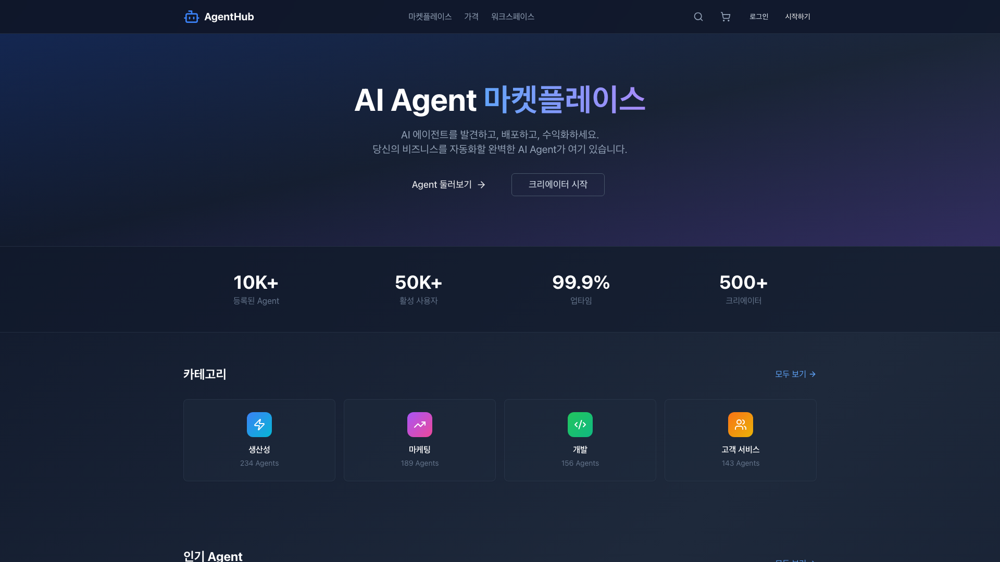


#### 마켓플레이스
_에이전트 마켓플레이스 - 다양한 AI 에이전트 검색 및 구매_
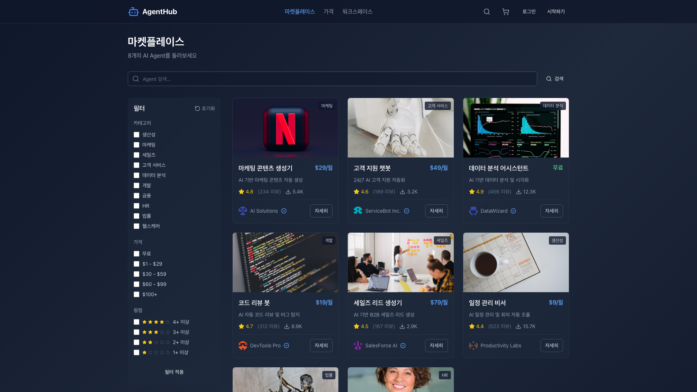


#### 워크스페이스
_워크스페이스 - 에이전트 관리 및 모니터링_
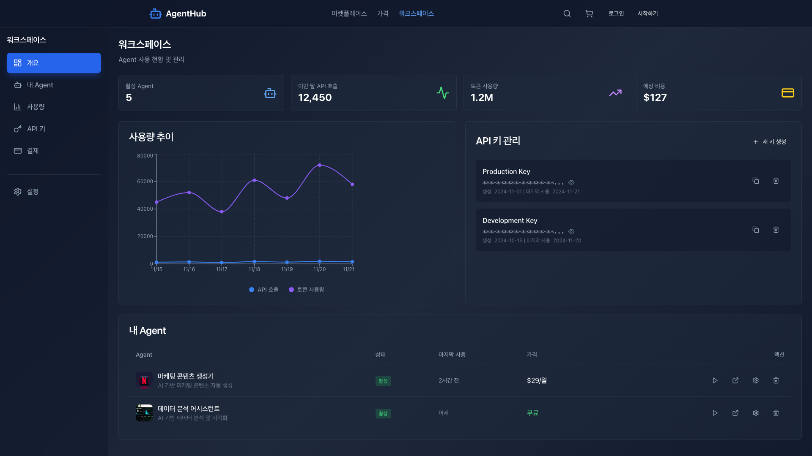


#### 요금제
_요금제 페이지 - 다양한 구독 플랜 안내_
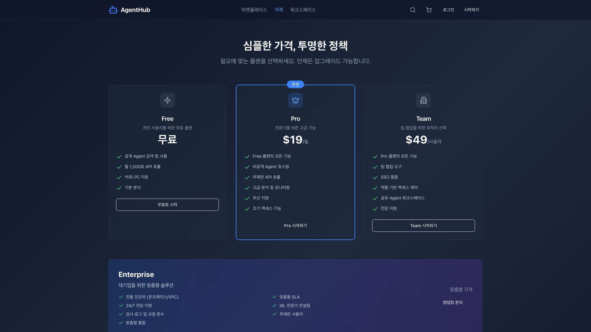

---

### 2.2 Documentation 사이트

문서화 Agent에 의해 생성된 서비스 소개 사이트이며,playWright MCP를 활용해 실행중인 React AgentHub (http://localhost:5179/) 화면을 캡쳐하고 문서화합니다. 

#### AgentHub 개요
_AgentHub 개요 문서 - 플랫폼 소개 및 핵심 기능 설명_
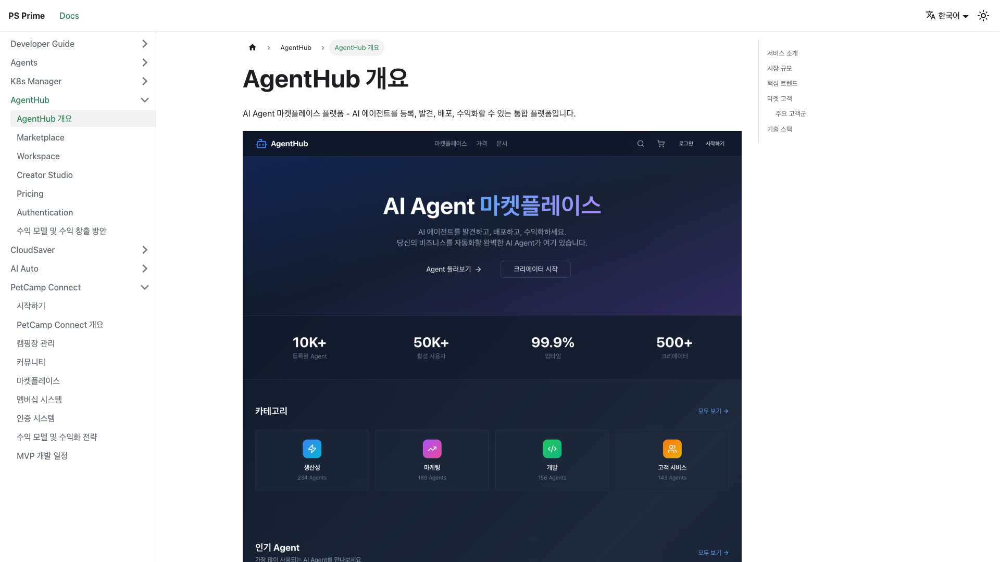


#### 마켓플레이스
_마켓플레이스 문서 - 에이전트 검색, 구매, 판매 가이드_
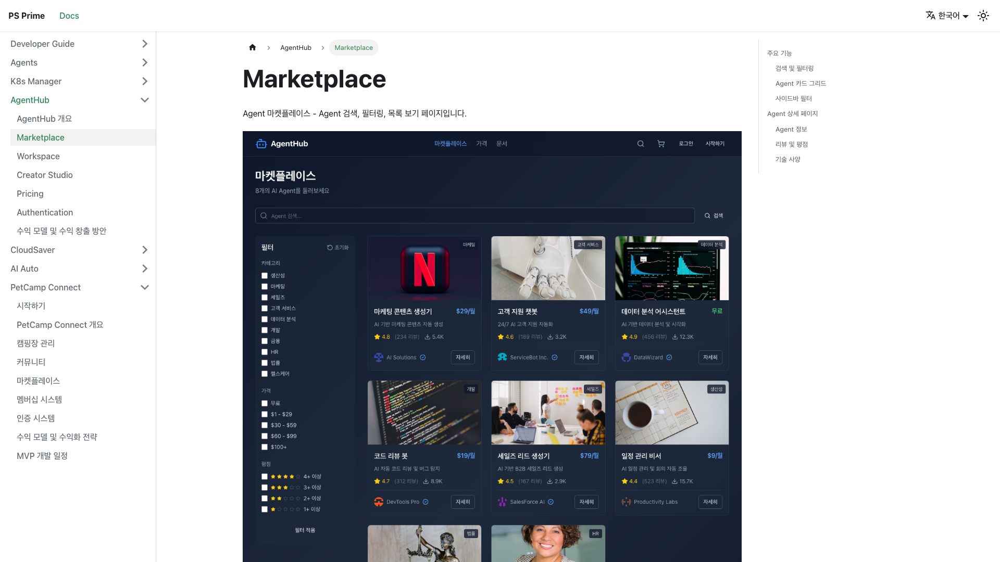


#### 워크스페이스
_워크스페이스 문서 - 에이전트 관리 및 설정 방법_


#### 크리에이터 스튜디오
_크리에이터 스튜디오 문서 - 에이전트 개발 및 배포 가이드_
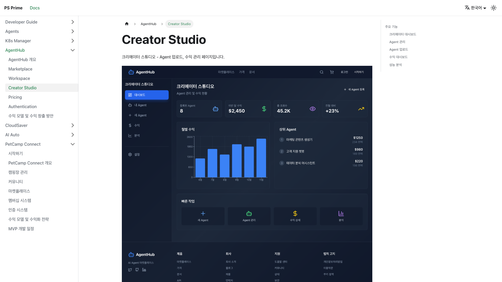


#### 요금제
_요금제 문서 - 구독 플랜별 기능 비교_
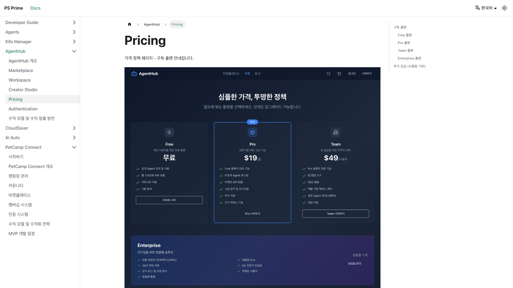


#### 수익 모델 및 수익 창출 방안
_수익 모델 문서 - 크리에이터 수익 창출 전략 및 정산 안내_
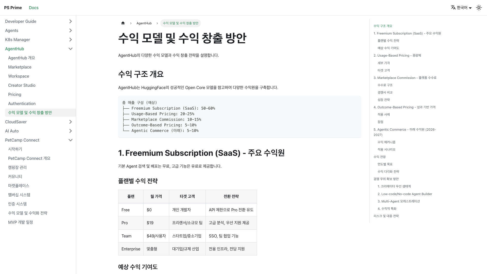


## 3. 시스템 아키텍처

### 3.1 전체 파이프라인 흐름

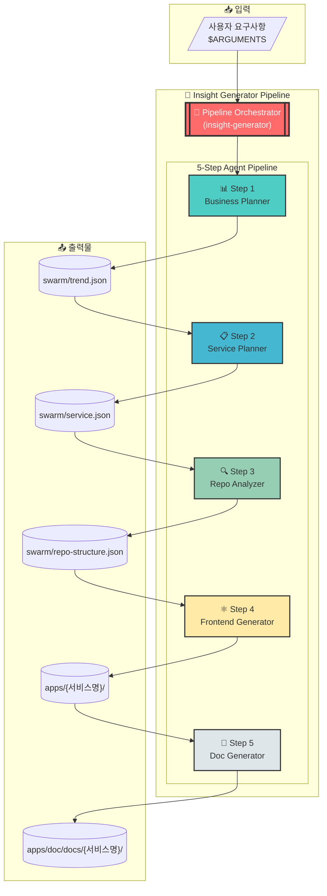

### 3.2 데이터 흐름 상세

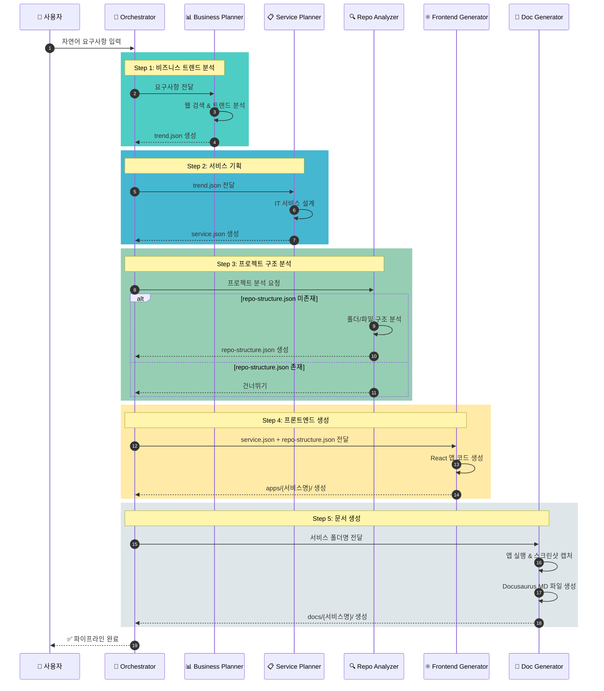

---

## 4. 에이전트 상세 설명

### 4.1 Business Planner (비즈니스 플래너)

| 항목          | 내용                                                    |
| ------------- | ------------------------------------------------------- |
| **역할**      | 시니어 비즈니스 분석가                                  |
| **모델**      | Claude Opus                                             |
| **입력**      | 사용자 자연어 요구사항                                  |
| **출력**      | `swarm/trend.json`                                      |
| **주요 기능** | 웹 검색을 통한 최신 트렌드 분석, 비즈니스 아이디어 도출 |

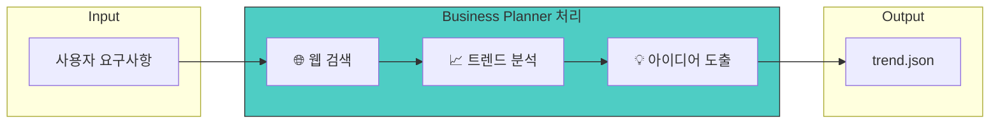

### 4.2 Service Planner (서비스 플래너)

| 항목          | 내용                                                 |
| ------------- | ---------------------------------------------------- |
| **역할**      | PM (프로젝트 매니저)                                 |
| **모델**      | Claude Opus                                          |
| **입력**      | `swarm/trend.json`                                   |
| **출력**      | `swarm/service.json`                                 |
| **주요 기능** | 비즈니스 아이디어를 구체적인 IT 서비스 기획으로 변환 |

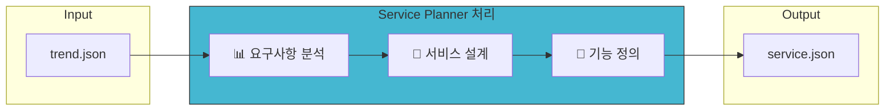

### 4.3 Repo Analyzer (저장소 분석기)

| 항목          | 내용                                   |
| ------------- | -------------------------------------- |
| **역할**      | 시니어 React 프론트엔드 개발자         |
| **모델**      | Claude Opus                            |
| **입력**      | 현재 프로젝트 구조                     |
| **출력**      | `swarm/repo-structure.json`            |
| **주요 기능** | 모노레포 구조 분석, 공통 컴포넌트 파악 |

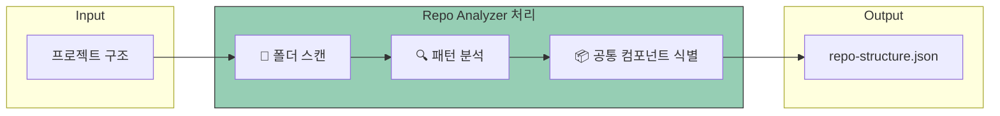

> **참고**: `repo-structure.json` 파일이 이미 존재하는 경우 이 단계는 건너뜁니다.

### 4.4 Frontend Generator (프론트엔드 생성기)

| 항목          | 내용                                              |
| ------------- | ------------------------------------------------- |
| **역할**      | 시니어 React 웹 프론트엔드 개발자                 |
| **모델**      | Claude Opus                                       |
| **입력**      | `swarm/service.json`, `swarm/repo-structure.json` |
| **출력**      | `apps/{서비스명}/` (React 앱)                     |
| **주요 기능** | 기획서 기반 React 웹 서비스 코드 생성             |

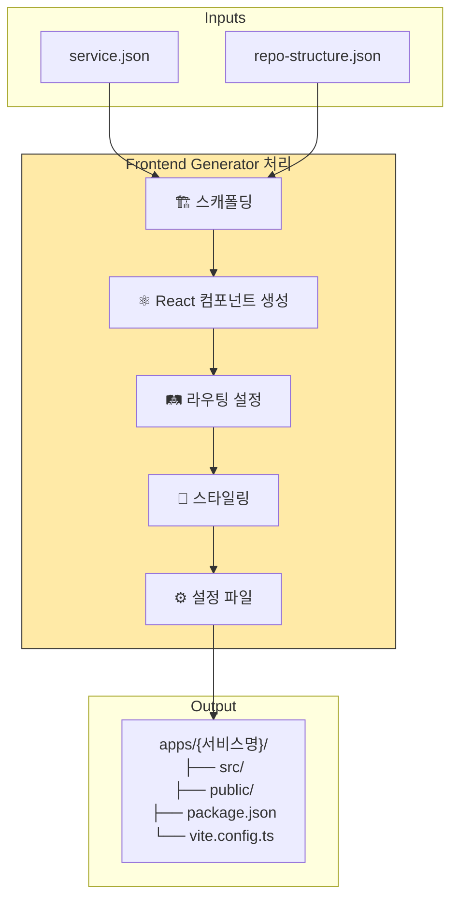

#### 생성되는 프로젝트 구조

```
apps/{서비스명}/
├── src/
│   ├── components/     # React 컴포넌트
│   ├── pages/          # 페이지 컴포넌트
│   ├── hooks/          # 커스텀 훅
│   ├── utils/          # 유틸리티 함수
│   ├── i18n/           # 다국어 설정
│   ├── App.tsx         # 메인 앱 컴포넌트
│   └── main.tsx        # 진입점
├── public/             # 정적 파일
├── package.json        # 의존성 정의
├── vite.config.ts      # Vite 설정
└── tsconfig.json       # TypeScript 설정
```

### 4.5 Doc Generator (문서 생성기)

| 항목          | 내용                                          |
| ------------- | --------------------------------------------- |
| **역할**      | PM (Docusaurus 문서 작성)                     |
| **모델**      | Claude Opus                                   |
| **입력**      | 생성된 서비스 폴더명, `swarm/service.json`    |
| **출력**      | `apps/doc/docs/{서비스명}/` (Docusaurus 문서) |
| **주요 기능** | 앱 실행, 스크린샷 캡처, MD 문서 생성          |

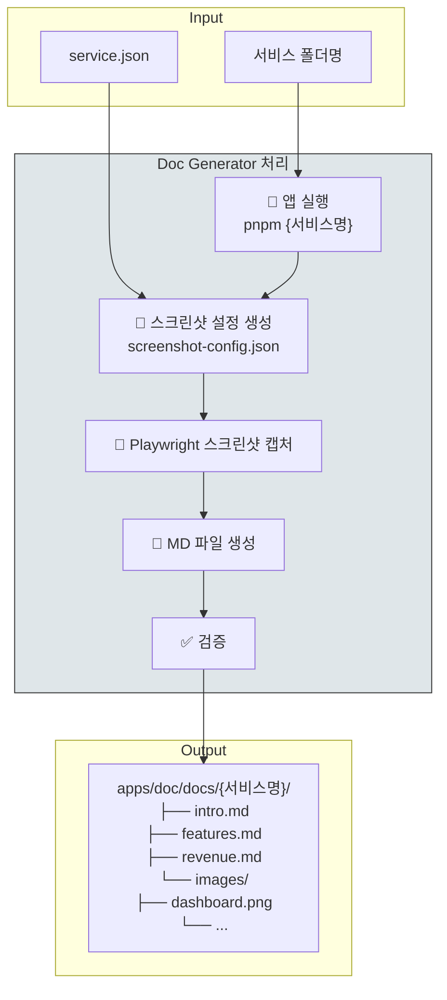

#### 문서 생성 프로세스

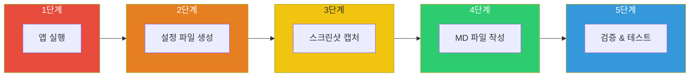

---

#### Insight Generator 문서

### 5.1 파이프라인 기술

| 구분                | 기술                    |
| ------------------- | ----------------------- |
| **AI 모델**         | Claude Opus (Anthropic) |
| **오케스트레이션**  | Claude Code CLI         |
| **브라우저 자동화** | Playwright              |
| **문서 생성**       | Docusaurus              |

### 5.2 생성되는 프로젝트 기술 스택

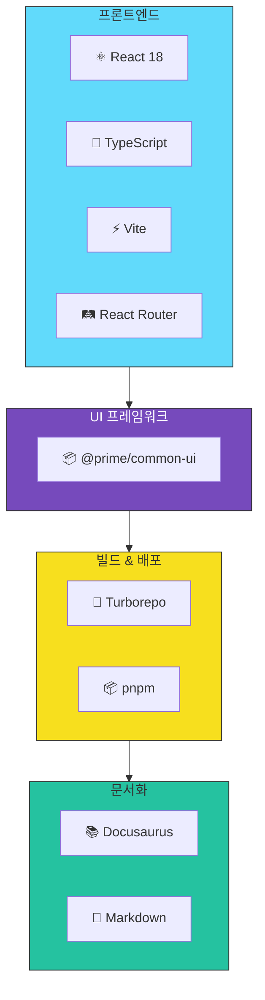

---

## 6. 모노레포 구조

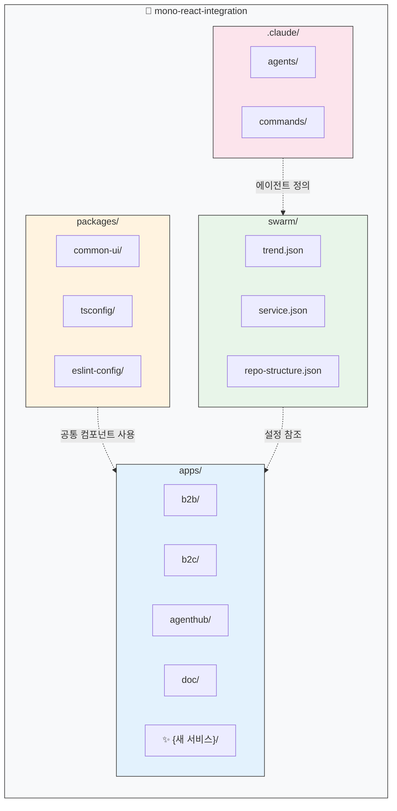

---

## 8. 파이프라인 실행 타임라인

```mermaid
gantt
    title Insight Generator 파이프라인 실행 타임라인
    dateFormat HH:mm
    axisFormat %H:%M

    section Step 1
    Business Planner     :a1, 00:00, 5m

    section Step 2
    Service Planner      :a2, after a1, 8m

    section Step 3
    Repo Analyzer        :a3, after a2, 3m

    section Step 4
    Frontend Generator   :a4, after a3, 15m

    section Step 5
    Doc Generator        :a5, after a4, 10m
```

---

_Generated by Insight Generator Pipeline_
_Document Version: 1.0_
_Date: 2025-12-05_
